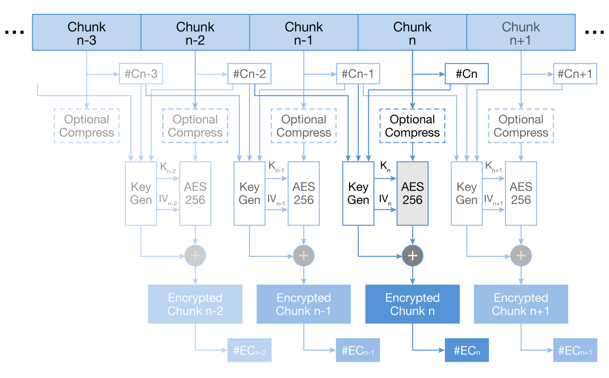

# Security - Self encryption
Security of a user's data is critical in the SAFE Network and this is, in part, provided by the self encryption process. The SAFE Network requires that data be unrecognisable as data and resistant to decryption, even in the event of an encryption algorithm being compromised.

Self encryption is used to mix up and encrypt data before it is sent out to the SAFE Network. This process is automatic and happens instantaneously.

As data is saved to a user's virtual hard-drive, it is broken up into at least three chunks. A data map is created and for each chunk a hash code (a unique digital finger print) is created and written to the data map. For additional security the data map is also run through an encryption process.

Each chunk is then encrypted to create random, non-repeating data. Finally, combined with the original hash codes, the chunks are further encrypted. The output hash code of each chunk is then added to the data map.

The data map, with hash codes before and after encryption, is used when retrieving and decoding the user's data, as the encryption process is non reversible.

The SAFE Network uses [data deduplication](http://en.wikipedia.org/wiki/Data_deduplication) to ensure that space is used efficiently when storing multiple copies of data which have been uniquely encrypted. The network is able to distinguish identical pieces of data by comparing the hashes of each chunk.

[Click here to see a video explaining the self encryption process](https://www.youtube.com/watch?v=Jnvwv4z17b4)

Here is an overview of the self encryption process.

